<style type="text/css">

body{ /* Normal  */
   font-size: 16px;
}
td {  /* Table  */
   font-size: 12px;
}
h1 { /* Header 1 */
 font-size: 28px;
 color: DarkOrange;
}
h2 { /* Header 2 */
 font-size: 25px;
 color: DarkOrange;
}
h3 { /* Header 3 */
 font-size: 20px;
 color: DarkOrange;
}
code.r{ /* Code block */
  font-size: 10px;
}
pre { /* Code block */
  font-size: 12px
}
</style>

<br>


## Background 
<br>
Our graduation is coming soon. As students in statistics, we know some of us are seeking for a career in data science. However, looking through long description of data scientist position, we found that data scientists seem to be highly rare 'awesome nerds'- those who embody the perfect skillsets of math and stats, **coding**, and communication. We, statstical students, don't need to worry about stats knowledge. However, the shortcoming for most of us, **coding**, is keeping us back at 'nerds'. Our motivation is to help us make most of Stack Overflow, improve coding skills and rush towards 'awesome nerds'.
<br>
  
<br>
  
<right>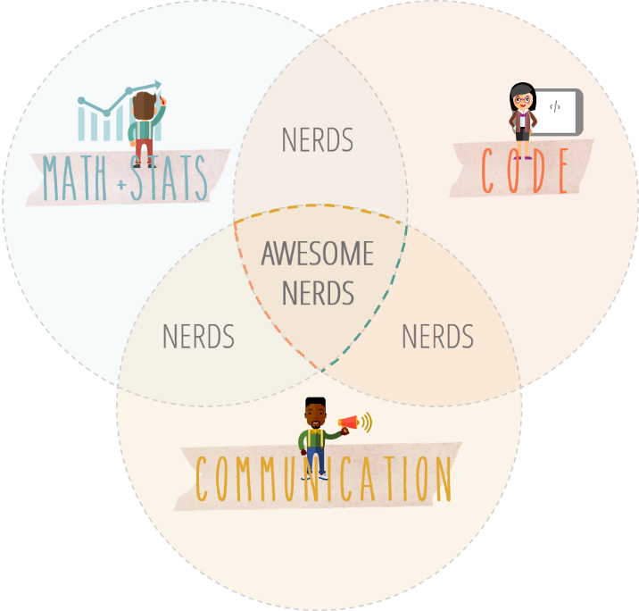</right>
  
<br>
  
<br>
  
## Objectives

<br>

#### 1.What are the differences between R questions and Python Questions? 

<br>

#### 2.How can we increase the probability that we got accepted answer for our question?

<br>

#### 3.Would it be possible to recommend paired and regularized tags automatically?

<br>

## Data Source

<br>
We explored two datasets provided by Stack Overflow on <a href="https://www.kaggle.com/datasets?sortBy=hottest&group=featured&search=questions">Kaggle Dataset</a>. One is for R Q&A, and the other is for Python Q&A, which are the top 2 popular programming languages that data scientists use. 

Each dataset is organized as three tables:

  1. Questions, contains the title, body, creation date, score, and owner ID for each question.

  2. Answers contains the body, creation date, score, and owner ID for each of the answers to these questions. The ParentId column links back to the Questions table.

  3. Tags contains the tags on each question besides the language ('R' or 'Python') tag.
<br>  
<center>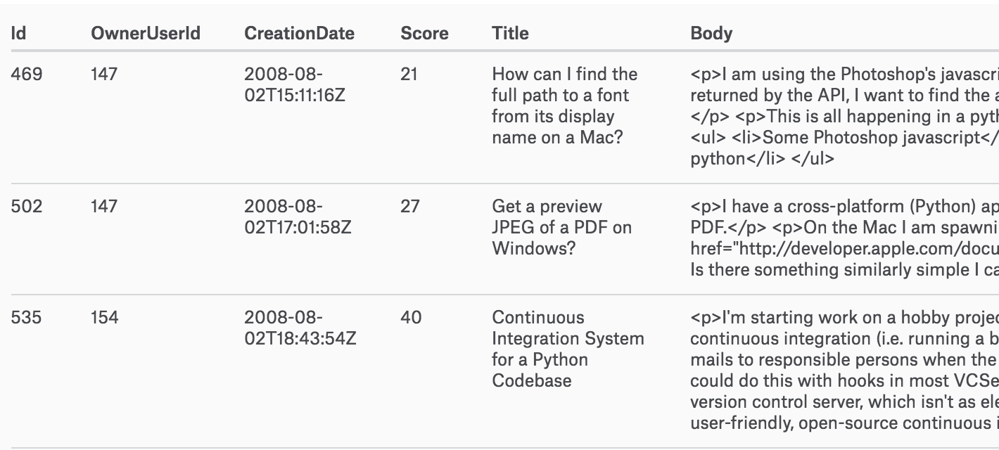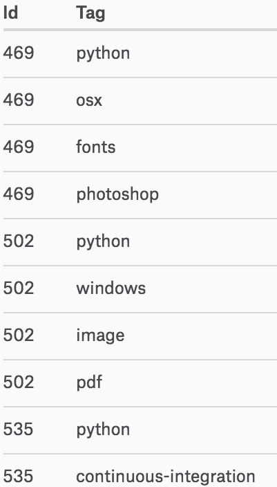</center>
<br>

## Comparison between R & Python Questions

<br>

**1. How do they change in terms of the popularity degree in past 8 years?**
<br>
<br>
Below is the question???s amount change from 2008 to 2016. It shows that Python and R keep growing in a high speed. Under the assumption that Stack Overflow is a relatively mature Q&A website that it???s users number doesn???t change extremely.
<br>
<br>
<br>
<center>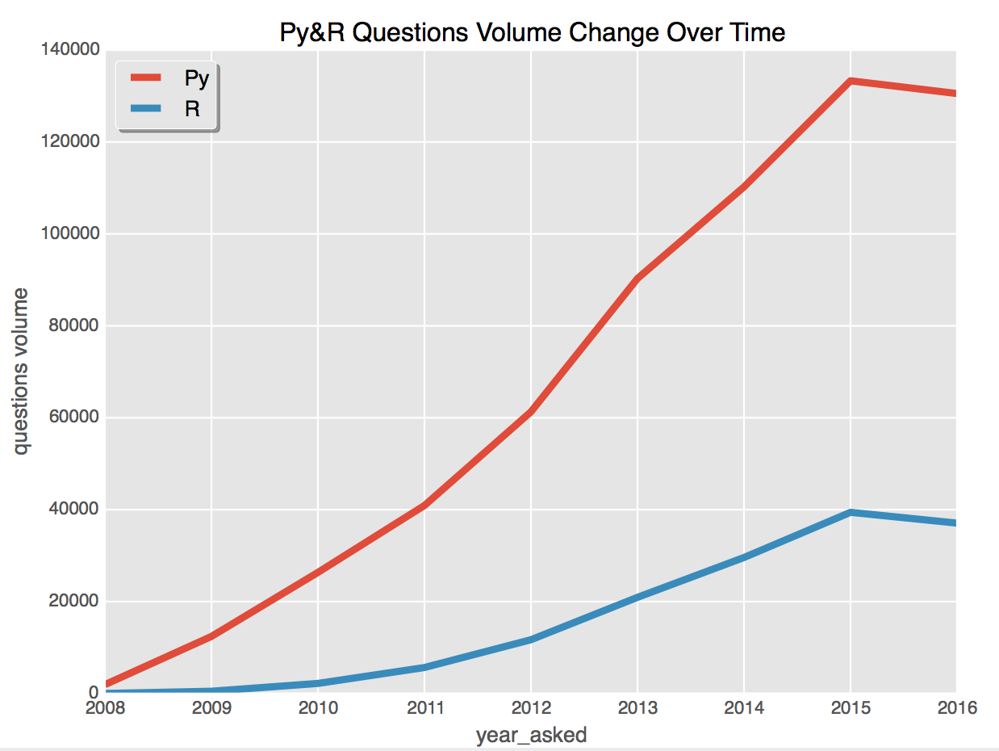</center>
<br>
<br>
<br>

**2. What???s the hottest topics for the two languages respectively?**
<br>
<br>
From the word cloud, we can see the focus attentions for R are ggplot2, dataframe and shiny, concentrating on data visualization and report delivery. Also, statistics, regression are common topics for R.
<br>
<br>
For Python, django, numpy, pandas, matplotlib attract our attention.
<br>
<br>
<center></center>
<br>
<br>
<br>

**3. How long does it take to have an answer posted after asking a question on Stack Overflow? **
<br>
<br>
For R, the mean time is 47.96628 days, median time is 0.032 days, that is over 45 minutes. While, for Python, the mean time is 70.01714 days, the median is 0.02 days, that is less than half an hour. Since the time distribution is not normal, we use rank sum test and find that the time for R and Python are significantly different.
<br>
<br>
<center>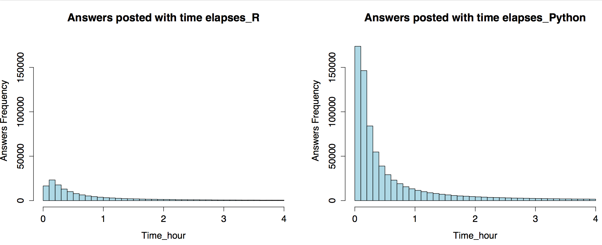</center>
<br>
**4. Predict Scores you can get as being active on the website?**
<br>
<br>
On a Q&A website, if you are an expert in programming languages, there might be some tricks for you to get higher scores.

By exploring the data, we find there???s obvious linear relationship between the question???s score and its corresponding highest answer???s score. Because there are high leverage points and outliers, we use robust linear model to regress answer's score over question's score.

For R, answer???s $score= 1.01 + 0.93* question???s score$

For Python, answer???s $score= 0.80 + 1.11* question???s score$

It indicates that you can get higher score by answering popular questions. Also, get relatively higher score by answering a question about Python, since the coefficient for Python is 1.11, higher than that for R.
<br>
<br>
<center>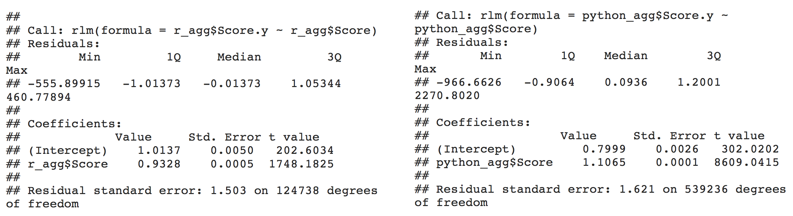</center>
<br>


<br>
<br>

<br>
<br>


## Score & Time Analysis
<br>
<br>
**Answer Score EDA**
<br>
<br>
R Answer Score summary:
<br>
```{r table1, echo=FALSE, message=FALSE, warnings=FALSE, results='asis'}
tabl <- "
| Min.   | 1st Qu. | Median | Mean   | 3rd Qu. | Max      |
| -----  | :-----: | :----: | :----: | :-----: | -------: |
| -8.000 | 1.000   | 1.000  | 2.833  | 3.000   | 1058.000 |
"
cat(tabl)
```
<br>
<br>
Python Answer Score summary:
<br>
```{r table2, echo=FALSE, message=FALSE, warnings=FALSE, results='asis'}
tabl <- "
| Min.  |1st Qu.|Median| Mean|3rd Qu.|   Max  |
|-------|-------|------|-----|-------|--------|
|-38.000| 0.000 | 1.000|3.028| 3.000 |8384.000|
"
cat(tabl)
```
<br>
<center>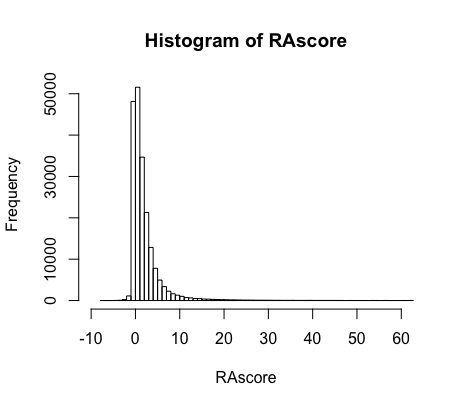</center>
<br>
<br>
Choose the good answer threshold = 3, the 3rd quantile.
<br>
<br>
**Time EDA**
<br>
<br>
Time(hours) = time spent until get a good answer
Label = 1, questions get good answers, Label = 0, otherwise.
<br>
<br>
R Questions: Total number of questions is 147071. Number of questions with Time=0 is 110. Number of questions never get a good answer is 100636.
<br>
<br>
R Time summary:
<br>
```{r table3, echo=FALSE, message=FALSE, warnings=FALSE, results='asis'}
tabl <- "
| Min. |1st Qu.|Median | Mean  |3rd Qu.| Max   |
|------|-------|-------|-------|-------|-------|
| 0.00 | 24.97 |1894.00|1302.00|1894.00|1894.00|
"
cat(tabl)
```
<br>
<br>
Python questions: Total number of questions is 607276. Number of questions with Time=0 is 429. Number of questions never get a good answer is 430177.
<br>
<br>
Python Time summary:
```{r table5, echo=FALSE, message=FALSE, warnings=FALSE, results='asis'}
tabl <- "
| Min. |1st Qu.|Median | Mean  |3rd Qu.| Max   |
|------|-------|-------|-------|-------|-------|
| 0.0  | 26.6  |2212.0 |1572.0 |2212.0 |2212.0 |
"
cat(tabl)
```
<br>
<br>
<center>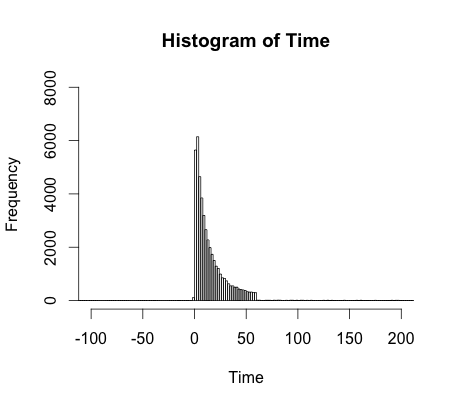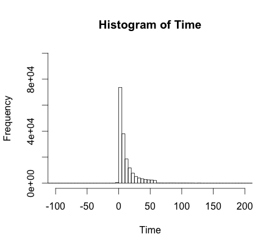</center>
<br>
<br>
**Gradient Boosting Trees: XGBoost**
<br>
<br>
Score ~ tag_count + max_tag_freq + sum_tag_freq + body_length + title_length + body_word_count + title_word_count + code_blocks_count + code_comments_count + url_count + img_count + code_length + comments_length
<br>
<br>
$\ \ \ \ \ \ \ \ \ \ \ \ \ \ \ \ \ \ \ \ \ \ \ \ \ \ \ \ \ \ \ \ \ \ \ \ \ \ $R Questions: MSE = 8.2; $\ \ \ \ \ \ \ \ \ \ \ \ \ \ \ \ \ \ \ \ \ \ \ \ \ \ \ \ \ \ \ \ \ \ \ \ \ \ \ \ \ \ \ \ \ $    Python Questions: MSE = 19.1
<br>
<br>
<center>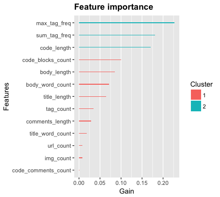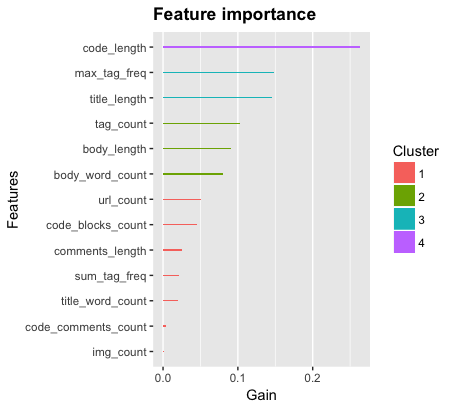</center>
<br>
<br>
**Logistic Regression**
<br>
<br>
Label prediction: Split data into train(80%) and test(20%), do logistic regression, calculate prediction accuracy.
<br>
<br>
R Questions: Prediction Accuracy = 0.7927178;  
<br>
<br>
```{r table4, echo=FALSE, message=FALSE, warnings=FALSE, results='asis'}
tabl <- "
|           | Estimate | Std.Error | z value |Pr(>abs(z))|
|-----------|----------|-----------|---------|-----------|
|(Intercept)|-1.7259480|0.009928074|-173.8452|  0        |
|Score      | 0.6181663|0.004818347|128.2943 |  0        |
"
cat(tabl)
```
<br>
<br>
Python Questions: Prediction Accuracy = 0.7923346
<br>
<br>
```{r table6, echo=FALSE, message=FALSE, warnings=FALSE, results='asis'}
tabl <- "
|           | Estimate | Std.Error | z value |Pr(>abs(z))|
|-----------|----------|-----------|---------|-----------|
|(Intercept)|-1.7462727|0.004808411|-363.1704|  0        |  
|Score      | 0.5649856|0.002307515| 244.8459|  0        |
"
cat(tabl)
```

<br>
<br>


<br>


## Tag Recommendation System

<br>
<br>

### Topic Modeling

<br>
**Latent Dirichlet Allocation (LDA)** is a Bayesian technique that is widely used for inferring the topic structure in corpora of documents. In LDA, a document can be represented as a mixture of $K$ topics, and every topic has a discrete distribution over words.

The generative process is:

1. For $k = 1$ to $K$,
    + Choose topic $\beta_k \sim \text{Dir}(\eta)$, where $\beta_k$ is a $V$-dimensional probability distribution on the $V$ words for topic $k$
2. For each document $d$ in corpus $D$,
    + Choose a topic distribution $\theta_d \sim \text{Dir}(\alpha)$, where $\theta_d$ is a $K$-dimensional probability distribution on the topics for document $d$
    + For each word index $n$ from 1 to $N_d$,
        + Choose a topic $z_{d,n} \sim \text{Discrete}(\theta_d)$
        + Choose word $w_{d,n} \sim \text{Discrete}(\beta_{z_{d,n}})$

<center>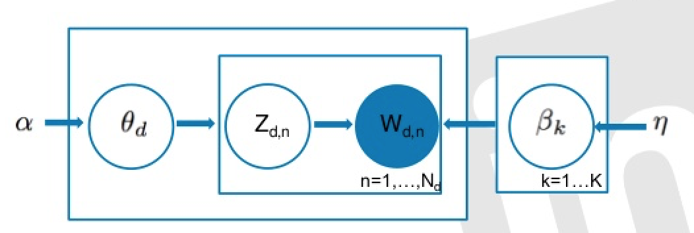</center>

<br>
<br>
First, we cleaned the text of R questions (Parse HTML, remove punctuations and stopwords, change to lower case...) and splitted questions into training and test set (training 80%, test 20%).

Then we used [`gensim.models.ldamodel`](https://radimrehurek.com/gensim/models/ldamodel.html) in Python to fit the LDA model.

<br>
```{r showChoro1, echo = FALSE}
htmltools::includeHTML("./figs/LDA.html")
```


### Tag Recommendation

<br>
We built the recommender system by ensembling the fitted `LDA model`, `user-based collaborative filtering (KNN)` and `content-based filtering`.

Now we use an example to show the process of tag recommendation.

Here is the cleaned text of a question in test set.

<center>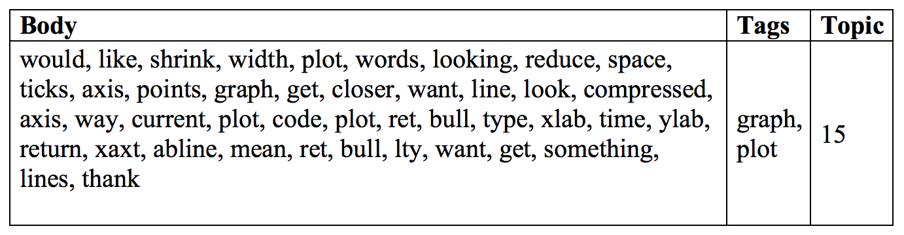</center>

<br>
The LDA model classified 5206 questions in training set to topic 15. We need to find 20 questions that are most similar to the untagged question.

The similarity of two questions given by `Jaccard Index`

$$J(A,B) = \frac{|A \cap B|}{|A \cup B|}$$

<br>
Count tags of these questions.

<center>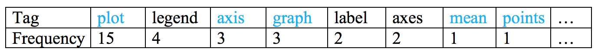</center>

<br>
The tags marked blue above table appear in the body of question, so we increase the frequency of these tags, then sort the tags again.

<center>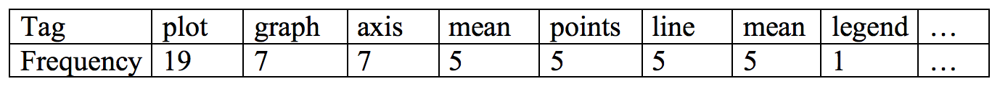</center>

<br>
Finally, we recommend the top 6 tags to this question.

<br>
Repeat this process for whole test set, the accuracy of recommend correct tags is `73%`.

<center></center>


