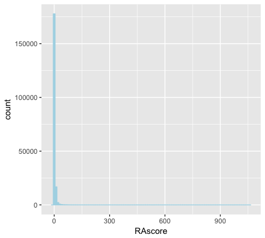
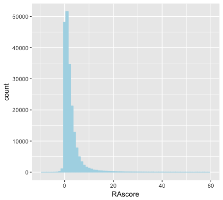
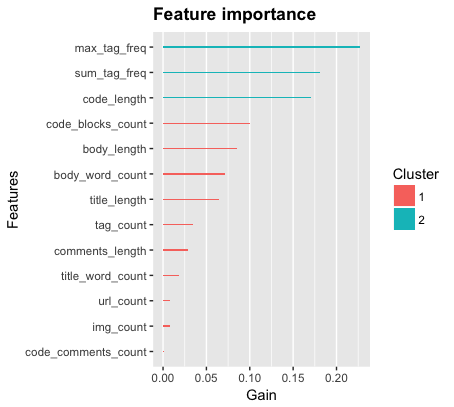
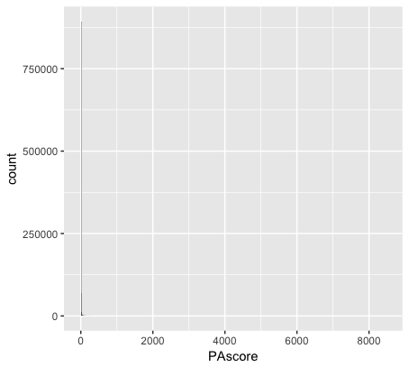
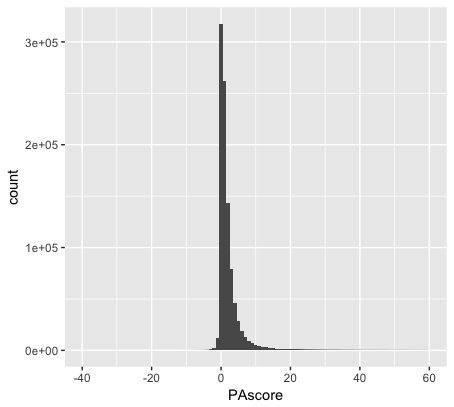
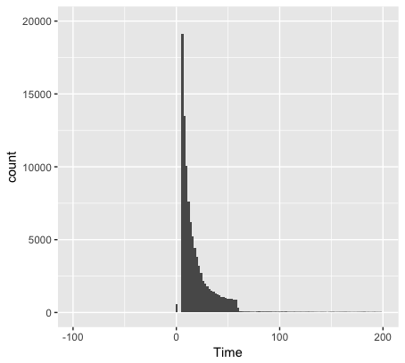
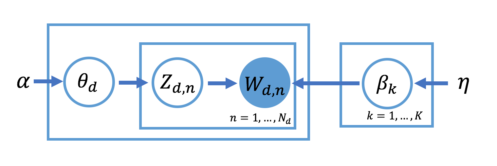
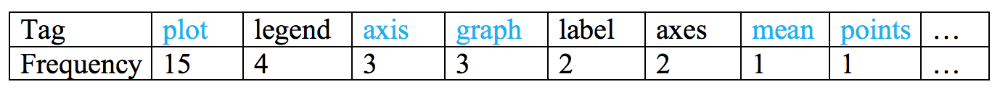

<style type="text/css">

body{ /* Normal  */
   font-size: 16px;
}
td {  /* Table  */
   font-size: 12px;
}
h1 { /* Header 1 */
 font-size: 28px;
 color: DarkBlue;
}
h2 { /* Header 2 */
 font-size: 25px;
 color: DarkBlue;
}
h3 { /* Header 3 */
 font-size: 20px;
 color: DarkBlue;
}
code.r{ /* Code block */
  font-size: 10px;
}
pre { /* Code block */
  font-size: 12px
}
</style>

## Comparison With R & Python

<br>

**Question1: How do they change in terms of the popularity degree in past 8 years?**
<br>
<br>
Below is the question’s amount change from 2008 to 2016. It shows that Python and R keep growing in a high speed. Under the assumption that Stack Overflow is a relatively mature Q&A website that it’s users number doesn’t change extremely.
<br>
<br>
<br>
<center></center>
<br>
<br>
<br>

**Question 2: What’s the hottest topics for the two languages respectively?**
<br>
<br>
From the word cloud, we can see the focus attentions for R are ggplot2, dataframe and shiny, concentrating on data visualization and report delivery. Also, statistics, regression are common topics for R.
<br>
<br>
<br>
<center></center>
<br>
<br>
<br>

**Question 3: How long does it take to have an answer posted after asking a question on Stack Overflow? **

**Question 4: Predict Scores you can get as being active on the website?**


<br>
<br>


## Score & Time Analysis
<br>
<br>
**R Answer Score EDA**
<br>
<br>
R Answer Score summary:
<br>
 Min. |1st Qu.|Median| Mean|3rd Qu.|   Max  
<br>
------|-------|------|-----|-------|--------
<br>
-8.000| 1.000 | 1.000|2.833| 3.000 |1058.000
<br>
<br>
<center></center>
<br>
<br>
<center></center>
<br>
<br>
Choose the good answer threshold = 3, the 3rd quantile.
<br>
<br>
**R Time EDA**
<br>
<br>
Time(hours) = time spent until get a good answer
Label = 1, questions get good answers, Label = 0, otherwise.
<br>
<br>
Total number of questions is 147071. Number of questions with Time=0 is 110. Number of questions never get a good answer is 100636.
<br>
<br>
R Time summary:
 Min. |1st Qu.|Median | Mean  |3rd Qu.| Max  
------|-------|-------|-------|-------|-------
 0.00 | 24.97 |1894.00|1302.00|1894.00|1894.00
<br>
<br>
<center></center>
<br>
<br>
**Random Forest**
<br>
<br>
Score ~ tag_count + max_tag_freq + sum_tag_freq + body_length + title_length + body_word_count + title_word_count + code_blocks_count + code_comments_count + url_count + img_count + code_length + comments_length
<br>
<br>
MSE = 8.2
<br>
<br>
<center></center>
<br>
<br>
**Logistic Regression**
<br>
<br>
Label prediction: Split data into train(80%) and test(20%), do logistic regression, calculate prediction accuracy.
<br>
<br>
Prediction Accuracy = 0.7927178
<br>
<br>
           | Estimate | Std.Error | z value |Pr(>|z|)
-----------|----------|-----------|---------|--------
(Intercept)|-1.7259480|0.009928074|-173.8452|  0
-----------|----------|-----------|---------|--------
Score      | 0.6181663|0.004818347|128.2943 |  0
<br>
<br>
<br>
**Python Answer Score EDA**
<br>
<br>
Python Answer Score summary:
 Min.  |1st Qu.|Median| Mean|3rd Qu.|   Max  
-------|-------|------|-----|-------|--------
-38.000| 0.000 | 1.000|3.028| 3.000 |8384.000
<br>
<br>
<center></center>
<br>
<br>
<center></center>
<br>
<br>
Choose the good answer threshold = 3, the 3rd quantile.
<br>
<br>
**Python Time EDA**
<br>
<br>
Total number of questions is 607276. Number of questions with Time=0 is 429. Number of questions never get a good answer is 430177.
<br>
<br>
Python Time summary:
 Min. |1st Qu.|Median | Mean  |3rd Qu.| Max  
------|-------|-------|-------|-------|-------
 0.0  | 26.6  |2212.0 |1572.0 |2212.0 |2212.0
<br>
<br>
<center></center>
<br>
<br>
**Random Forest**
<br>
<br>
Score ~ tag_count + max_tag_freq + sum_tag_freq + body_length + title_length + body_word_count + title_word_count + code_blocks_count + code_comments_count + url_count + img_count + code_length + comments_length
<br>
<br>
MSE = 19.1
<br>
<br>
<center></center>
<br>
<br>
**Logistic Regression**
<br>
<br>
Label prediction: Split data into train(80%) and test(20%), do logistic regression, calculate prediction accuracy.
<br>
<br>
Prediction Accuracy = 0.7923346
<br>
<br>
           | Estimate | Std.Error | z value |Pr(>|z|)
-----------|----------|-----------|---------|--------
(Intercept)|-1.7462727|0.004808411|-363.1704|  0
-----------|----------|-----------|---------|--------
Score      | 0.5649856|0.002307515| 244.8459|  0

<br>
<br>
<br>


## Topic Modeling

<br>
**Latent Dirichlet Allocation (LDA)** is a Bayesian technique that is widely used for inferring the topic structure in corpora of documents. In LDA, a document can be represented as a mixture of $K$ topics, and every topic has a discrete distribution over words.

The generative process is:

1. For $k = 1$ to $K$,
    + Choose topic $\beta_k \sim \text{Dir}(\eta)$, where $\beta_k$ is a $V$-dimensional probability distribution on the $V$ words for topic $k$
2. For each document $d$ in corpus $D$,
    + Choose a topic distribution $\theta_d \sim \text{Dir}(\alpha)$, where $\theta_d$ is a $K$-dimensional probability distribution on the topics for document $d$
    + For each word index $n$ from 1 to $N_d$,
        + Choose a topic $z_{d,n} \sim \text{Discrete}(\theta_d)$
        + Choose word $w_{d,n} \sim \text{Discrete}(\beta_{z_{d,n}})$

<center></center>

<br>
<br>
First, we cleaned the text of R questions (Parse HTML, remove punctuations and stopwords, change to lower case...) and splitted questions into training and test set (training 80%, test 20%).

Then we used [`gensim.models.ldamodel`](https://radimrehurek.com/gensim/models/ldamodel.html) in Python to fit the LDA model.

<br>
```{r showChoro1, echo = FALSE}
htmltools::includeHTML("./figs/LDA.html")
```


## Tag Recommendation

<br>
We built the recommender system by ensembling the fitted `LDA model`, `user-based collaborative filtering (KNN)` and `content-based filtering`.

Now we use an example to show the process of tag recommendation.

Here is the cleaned text of a question in test set.

<center></center>

<br>
The LDA model classified 5206 questions in training set to topic 15. We need to find 20 questions that are most similar to the untagged question.

The similarity of two questions given by `Jaccard Index`

$$J(A,B) = \frac{|A \cap B|}{|A \cup B|}$$

<br>
Count tags of these questions.

<center></center>

<br>
The tags marked blue above table appear in the body of question, so we increase the frequency of these tags, then sort the tags again.

<center></center>

<br>
Finally, we recommend the top 6 tags to this question.

<br>
Repeat this process for whole test set, the accuracy of recommend correct tags is `73%`.

<center></center>


